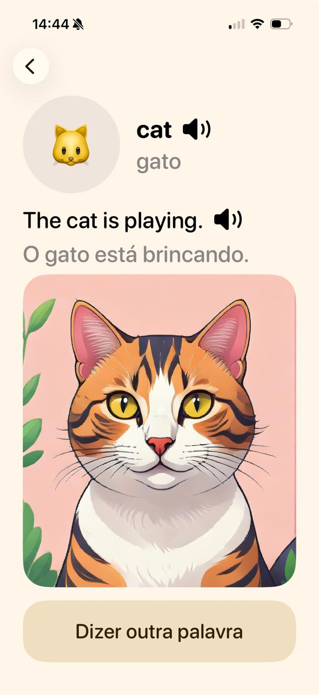
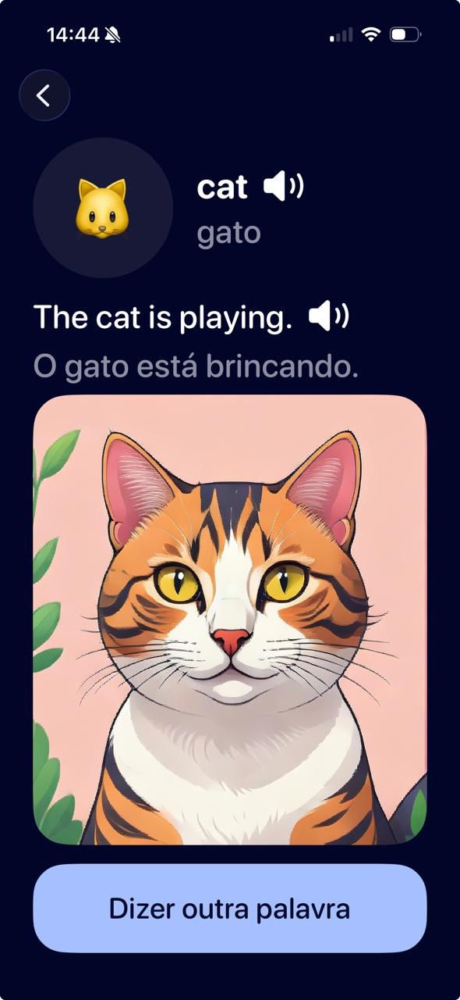
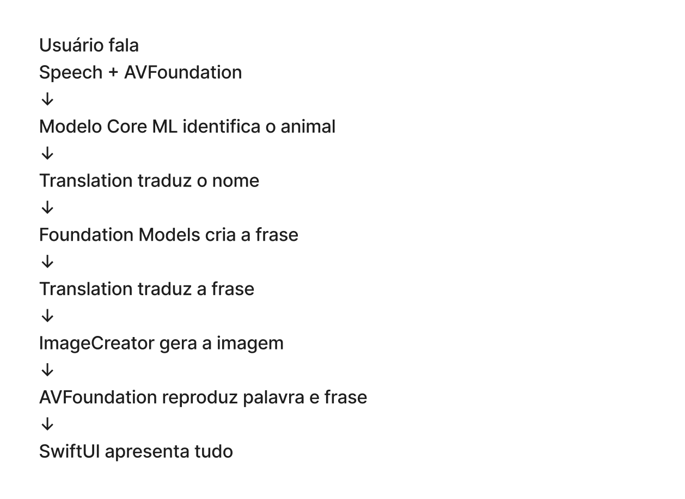
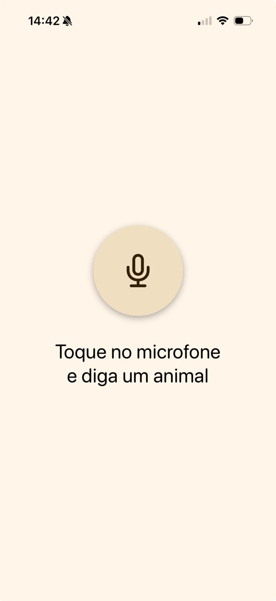

# 🐾 FalaZoo

**PoC — Proof of Concept**

Uma experiência iOS desenvolvida para explorar Inteligência Artificial e tecnologias multimodais no ecossistema Apple.

  
  &nbsp;&nbsp;&nbsp;
  

  Experiência nos modos claro e escuro.

---

## Sobre o projeto

O **FalaZoo** é uma prova de conceito desenvolvida para investigar como diferentes tecnologias do ecossistema Apple podem ser integradas em uma aplicação iOS.

Para colocar esse estudo em prática, criamos uma experiência voltada ao aprendizado infantil de animais e vocabulário em inglês, combinando **reconhecimento de fala, classificação, tradução, geração de frases, áudio e geração de imagens** em um único fluxo.

A interação não exige que o usuário diga apenas o nome isolado de um animal. O aplicativo também consegue receber **frases completas em português** e identificar o animal presente na transcrição.

Por exemplo:

> **“O gato toma leite.”**

A fala é transcrita, o modelo identifica **“gato”** dentro da frase e utiliza essa categoria para continuar a experiência.

Caso nenhum dos animais suportados seja identificado, a aplicação informa que o reconhecimento não foi possível e permite uma nova tentativa.

---

## 🎥 Demonstração

A demonstração apresenta dois cenários da aplicação:

- **“O gato toma leite”** — o FalaZoo recebe uma frase completa, identifica o animal presente na transcrição e executa o fluxo até apresentar o resultado. Também são demonstrados os recursos de áudio para reprodução da palavra e da frase em inglês.
- **“Grilo”** — como esse animal não pertence às categorias suportadas pelo modelo, a aplicação apresenta o estado de não reconhecimento.

<a href="https://github.com/user-attachments/assets/8561c29a-5ef7-4c28-8840-10bc98f0a88d">
  ▶️ <strong>Assistir à demonstração do FalaZoo</strong>
</a>

---

## Como funciona

A experiência começa pela fala do usuário e percorre diferentes etapas de processamento até que o conteúdo final seja apresentado na interface.

  

---

## Tecnologias

- **Swift**
- **SwiftUI**
- **Speech** — reconhecimento da fala do usuário e geração da transcrição.
- **AVFoundation** — reprodução da palavra e da frase em áudio.
- **Create ML** — treinamento do modelo de classificação desenvolvido para a POC.
- **Core ML** — integração e execução do modelo responsável por identificar o animal na transcrição.
- **Translation** — tradução do nome do animal e dos conteúdos utilizados na experiência.
- **Foundation Models** — geração de uma frase relacionada ao animal identificado.
- **ImageCreator** — geração programática da representação visual do animal.

---

## Dataset e modelo

Para explorar também o processo de criação e treinamento de modelos, construímos **nosso próprio dataset para fins de estudo**.

Durante sua elaboração, realizamos diferentes testes e refinamos as categorias de acordo com a proposta da aplicação. Priorizamos animais que possuíam **emojis compatíveis com a experiência visual do app** e removemos categorias que não se adequavam ao escopo, como alguns insetos, animais repetidos e animais fantásticos.

O dataset final reuniu **79 animais e 3.680 exemplos**:

- **2.944 exemplos para treinamento — 80%**
- **736 exemplos para teste — 20%**

Os exemplos foram construídos com diferentes frases e variações relacionadas ao mesmo animal, permitindo que o modelo reconhecesse a categoria em diferentes contextos, em vez de depender apenas do nome isolado ou de uma estrutura fixa.

Após a preparação dos dados, o modelo foi treinado com **Create ML** e integrado à aplicação por meio do **Core ML**.

---

## Interface

A interface foi desenvolvida em **SwiftUI**, com foco em uma experiência simples, amigável e coerente com o contexto infantil do projeto.

Também foram considerados diferentes estados da interação, como **pronto para ouvir, escuta ativa, processamento, resultado e erro**.

  
  &nbsp;&nbsp;
  
  &nbsp;&nbsp;
  

  Entrada por voz → escuta ativa → resultado.

A aplicação também possui suporte aos modos **claro e escuro**, mantendo a identidade visual e a legibilidade da experiência nos dois temas.

---

## Desenvolvimento colaborativo

O FalaZoo foi desenvolvido por **Rafaela Arruda** e **Elton Hugo**.

Ambos participaram do estudo das tecnologias utilizadas e da investigação de como elas poderiam ser integradas dentro da aplicação.

Para tornar o desenvolvimento mais organizado, a implementação foi dividida principalmente entre **interface** e **lógica e integrações**.

### Rafaela Arruda — Interface e desenvolvimento em SwiftUI

Responsável principalmente por:

- desenvolvimento das telas e componentes em SwiftUI;
- construção do fluxo visual da aplicação;
- organização e refinamento dos layouts;
- implementação dos diferentes estados da interface;
- adaptação da experiência para os modos claro e escuro.

### Elton Hugo — Lógica e integrações

Responsável principalmente por:

- implementação da lógica da aplicação;
- integração dos frameworks e tecnologias utilizadas;
- desenvolvimento dos serviços responsáveis pelo processamento;
- integração do modelo treinado com Create ML e Core ML;
- conexão entre reconhecimento de fala, classificação, tradução, geração de frases, áudio e geração de imagens.

Apesar dessa divisão, o processo de desenvolvimento foi colaborativo. Durante diferentes etapas de testes e resolução de problemas, **ambos participaram ativamente da investigação das tecnologias e do comportamento da aplicação**, buscando compreender não apenas como implementar cada recurso, mas também os motivos por trás de comportamentos inesperados e as possíveis abordagens para solucioná-los.

---

## Requisitos

- **iOS 26.5 ou superior**
- Interface desenvolvida e testada para **iPhone 16**
- Xcode compatível com o deployment target do projeto

Na primeira execução, a aplicação solicita as permissões necessárias para utilização do **microfone e reconhecimento de fala**.

---

## Executando o projeto

1. Clone este repositório.
2. Abra o projeto no Xcode.
3. Selecione um iPhone 16 ou dispositivo compatível.
4. Compile e execute a aplicação.
5. Autorize o acesso ao microfone e ao reconhecimento de fala quando solicitado.
